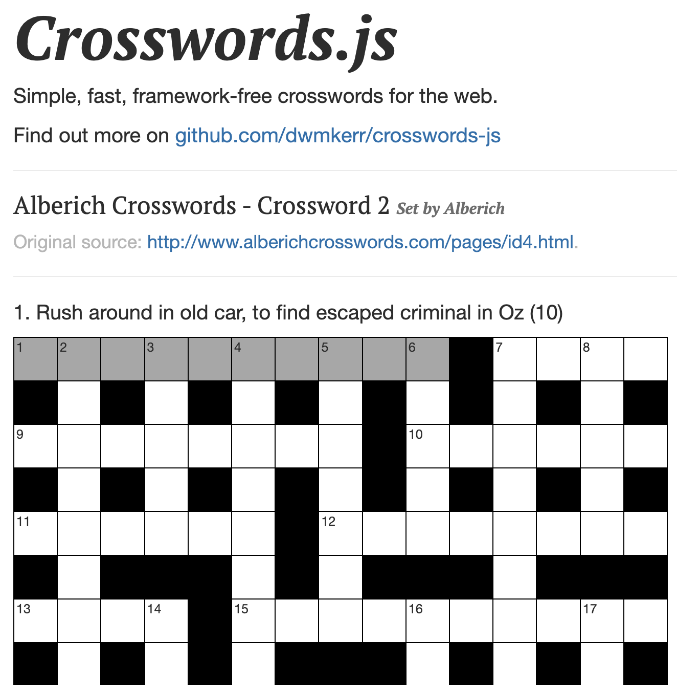

# crosswords-js <!-- omit from toc -->

<!-- ALL-CONTRIBUTORS-BADGE:START - Do not remove or modify this section -->

[![All Contributors][1]][2]

<!-- ALL-CONTRIBUTORS-BADGE:END -->

[![Release Please][3]][4]
[![NPM Package Version][5]][6]
[![codecov][7]][8]

> **IMPORTANT**: This is work in progress! The API may change dramatically as I work out what is most suitable.

Tiny, lightweight crossword control for the web. **crosswords-js** is:

- Lightweight
- Fast
- Simple
- Framework-free

Inspired by the excellent free online crosswords on [The Guardian Crosswords][18].

Demo: [dwmkerr.github.io/crosswords-js/][9]

<a href="https://dwmkerr.github.io/crosswords-js/"></a>

## Index <!-- omit from toc -->

<!-- vim-markdown-toc GFM -->

- [Quickstart](#quickstart)
  - [Application Programming Interface (API)](#application-programming-interface-api)
  - [Sample applications](#sample-applications)
- [Developer Guide](#developer-guide)
  - [Setting up your dev environment](#setting-up-your-dev-environment)
  - [Documentation](#documentation)
  - [Quality assurance](#quality-assurance)
  - [Building the dev environment assets for production](#building-the-dev-environment-assets-for-production)
- [Keyboard Functionality](#keyboard-functionality)
- [Crossword Definition Tips](#crossword-definition-tips)
- [Design Overview](#design-overview)
- [Design Goals](#design-goals)
- [Build Pipelines](#build-pipelines)
  - [Pull Request Pipeline](#pull-request-pipeline)
  - [Release Pipeline](#release-pipeline)
- [Adding Contributors](#adding-contributors)
- [Managing Releases](#managing-releases)
- [Contributors](#contributors)
- [TODO](#todo)

<!-- vim-markdown-toc -->

## Quickstart

1. Install the package:

   ```bash
   npm install crosswords-js
   ```

2. Include the minified JavaScript package source and CSS in your webpage:

   ```html
   <link
     href="node_modules/crosswords-js/dist/crosswords.css"
     rel="stylesheet"
   />
   <script src="node_modules/crosswords-js/dist/crosswords.js"></script>
   ```

3. To create a crossword, locate or edit a [**CrosswordDefinition**][29], which can be `import`ed from a simple JSON file:

   ```json
   {
     "width": 15,
     "height": 15,
     "acrossClues": [
       {
         "x": 1,
         "y": 1,
         "clue": "1. Conspicuous influence exerted by active troops (8,5)"
       },

   ...

     ],
     "downClues": [
       {
         "x": 3,
         "y": 1,
         "clue": "1. A coy sort of miss pointlessly promoting lawlessness (9)"
       },

   ...

     ]
   }
   ```

   Complete _CrosswordDefinition_ source file examples can be found [here][21], [there][22] or [everywhere][36].

   Further on, the _CrosswordDefinition_ needs to be compiled into a [**CrosswordModel**][37]. Compiling validates the the _CrosswordDefinition_, making sure that there are no incongruities in the structure, for example:

   - overlapping clues
   - clues which don't fit in the grid bounds
   - ...and so on.

4. In your JavaScript code, load the **crosswords-js** package and a _CrosswordDefinition_:

   ```js
   import { compileCrossword, Controller } from './crosswords.js';
   import crosswordDefinition from './crosswords/ftimes_17095.json';
   ```

5. Compile `crosswordDefinition` - creating the [**CrosswordModel**][37] (`model`). Wrap the call to `compileCrossword` in a `try/catch` block, as any errors in `crosswordDefinition` will generate an exception:

   ```js
   try {
     const model = compileCrossword(crosswordDefinition);
   } catch (err) {
     console.log(`Error compiling crossword: ${err}`);
   }
   ```

6. Now get the [DOM][20] elements which will be the parents for the crossword grid and clues blocks:

   > For example, if we have placeholder `div` elements somewhere in our webpage:
   >
   > ```html
   > ...
   > <div id="crossword-grid-placeholder" />
   > ...
   > <div id="crossword-clues-placeholder" />
   > ```
   >
   > We locate the element via the webpage [DOM][20]:
   >
   > ```js
   > const gridParent = document.getElementById('crossword-grid-placeholder');
   > const cluesParent = document.getElementById('crossword-clues-placeholder');
   > ```

7. And pass the `model`, `gridParent` and `viewParent` elements into the [**Controller**][38] constructor:

   ```js
   let controller = new Controller(model, gridParent, cluesParent);
   ```

   This binds the crossword **gridView** anf **cluesView** into the webpage [DOM][20].

### Application Programming Interface (API)

You can use the `controller` to programmatically manipulate the **gridView** - the crossword grid [DOM][20] element.

1. Invoke the [**user event handlers**][39]

- Call the _user event handler_ methods of the `controller` directly in code
  ```js
  // Check the current clue answer against the solution.
  controller.testCurrentClue();
  ```
- Bind the _user event handler_ methods via `id` or `class` attributes on DOM elements in your HTML markup, such as _buttons_.

  ```html
  <div id="clue-buttons">
    <p>Clue</p>
    <button id="test-clue">Test</button>
    <button id="clean-clue">Clean</button>
    <button id="reveal-clue">Reveal</button>
    <button class="reset-clue">Reset</button>
    <button class="reset-clue">MoSet</button>
  </div>
  ```

  ```js
  // Bind one element with id "test-clue"
  controller.bindEventHandlerToId("test-clue", "click", document);

  // Using default arguments for
  // eventName ("click") and dom (document)
  controller.bindEventHandlerToId("reveal-clue");

  // Bind event handler to multiple elements with class "reset-clue"
  // default arguments are available as before
  controller.bindEventHandlerToClass("reset-clue", "click", document);
  });

  // Bind ALL the user event handlers, using defaults
  controller.bindEventHandlersToIds();

  // Bind the user event handlers to ALL elements with
  // the given class(es), passing an array of one class name
  controller.bindEventHandlersToClass(["reset-clue"]);
  ```

2. You can also provide your own handlers to listen to [**controller events**][40].

For further information on these topics, consult the [module API][30] documentation.

For examples, refer to the [development server code][31].

### Sample applications

The _development server_ is a pure [Node.js][32] application of the the **crosswords-js** package. It exercises nearly all the available functionality. The code is found in the [dev][33] directory of this repository.

```bash
# Open the development server on http://localhost:5173
npm run dev
```

You can find an **Angular** application in the [sample][34] directory of this repository. To run the application:

```bash
# Run the Angular sample app
npm start
```

## Developer Guide

### Setting up your dev environment

Ensure you are using Node LTS. I recommend using [Node Version Manager][10] for this:

```bash
# Install/update node to latest long-term-support (LTS) version, and install/update npm to latest version.
nvm install --lts --latest-npm
nvm use --lts
```

Check out the code, then, from the root directory of the repository, run:

```bash
# Fetch all dependent packages
npm install
# Start the development server
npm run dev
```

- The development server webpage is visible at [http://localhost:5173/][11]
  - _The webpage will dynamically refresh whenever you save your source edits_
- Edit the development webpage HTML: [dev/index.html][23]
- Edit the development webpage JavaScript: [dev/index.js][23]
- Edit the development webpage CSS via the [**less**][24] source: [dev/index.less][25]
- _Less files are dynamically compiled to CSS by [ViteJS][28] for the development server_.

### Documentation

The project documentation is written in [Markdown][27] and is located in the repository at [`<repo-root>/docs`][42].

- [Documentation index][40]

### Quality assurance

We use [MochaJS][26] for unit testing. The test source code is located in the repository at `<repo-root>/test`. Run the tests with:

```bash
npm test
```

Linting is provided by [ESLint][43], which is also configured to use [Prettier][44] for code formatting:

```bash
# Lint the code.
npm run lint
# Lint and fix the code.
npm run lint:fix
```

Documentation and HTML can be checked for standard conformance using [Prettier][44]:

```bash
# Check html and docs for correctness.
npm run prettier
# Check and fix html and docs for correctness.
npm run prettier:fix
```

Spelling can be checked using [CSpell][45]:

```bash
# Check _staged_ files for spelling.
npm run spell
# Check new and changed files for spelling.
npm run spell:changed
# Check all files for spelling.
npm run spell:all
```

To automate all these checks on each commit to your local git repository, create a **pre-commit hook** in your repository. From the root directory of your repository:

```bash
cat << EOF > .git/hooks/pre-commit
#!/bin/sh
npm run spell && \\
npm run prettier:fix && \\
npm run lint:fix && \\
npm test
EOF
chmod u+x .git/hooks/pre-commit
```

Please install our git **commit template**. This enables project commit guidelines to be prefixed to the standard git commit message.

From the root directory of your repository:

```bash
git config --local commit.template ./.git-commit-template.txt
```

### Building the dev environment assets for production

The `dev` environment **production assets** are built by [ViteJS][28] at [`<repo-root>/dev/dist`][46]. The `dist` folder is created when the assets are built.

```bash
# Build the assets under <root>/dev/dist
npm run dev:build
```

You can _preview_ the **production** assets by running the following command and opening a browser on [`http://localhost:4173/`][47]

```bash
# Build the assets and preview locally at http://locahost:4173
npm run dev:prod
```

## Keyboard Functionality

_You can also find these keyboard shortcuts in the [documentation][48]_

- **Left**/**Right**/**Up**/**Down**: Move (if possible) to the cell in the direction specified.
- **Space**: Move to the next cell in the focused clue, if one exists.
- **Delete**: Delete the current cell.
- **Backspace**: Delete the current cell, and move to the previous cell in the focused clue, if one exists.
- **Tab**: Move to the first cell of the next clue, 'wrapping' to the first clue.
- **Shift+Tab**: Move to the last cell of the previous clue, 'wrapping' to the last clue.
- **A**-**Z**: Enter the character. Not locale aware!
- **Enter**: At a clue intersection, switch between across and down.

## Crossword Definition Tips

**How do I create a clue which spans multiple parts of a crossword?**

This is a little fiddly. I have tried to ensure the syntax is as close to what a reader would see in a printed crossword to make this as clear as possible. Here is an example:

```json
{
  "downClues": [{
    "x": 6, "y": 1
    "clue": "4,21. The king of 7, this general axed threat strategically (9)"
  }],
  "acrossClues": [{
    "x": 1, "y": 11,
    "clue": "21. See 4 (3,5)"
  }]
}
```

Note that the _answer structure_ (which would be `(9,3,5)` in a linear clue) has separated. However, the crossword will render the full answer structure for the first clue (and nothing for the others).

An example of a crossword with many non-linear clues is at: <https://www.theguardian.com/crosswords/cryptic/28038> - I have used this crossword for testing (but not included the definition in the codebase as I don't have permissions to distribute it).

## Design Overview

The design of this project follows the [Model-view-controller (MVC) design pattern][19]. The naming of files and code artifacts follow from this pattern.

## Design Goals

This project is currently a work in progress. The overall design goals are:

1. This should be _agnostic_ to the type of crossword. It shouldn't depend on any proprietary formats or structures used by specific publications.
2. This should be _accessible_, and show how to make interactive content which is inclusive and supports modern accessibility patterns.
3. This project should be _simple to use_, without requiring a lot of third party dependencies or knowledge.

## Build Pipelines

There are two pipelines that run for the project:

### Pull Request Pipeline

Whenever a pull request is raised, the [Pull Request Workflow][12] is run. This will:

- Install dependencies
- Lint
- Run Tests
- Upload Coverage

Each stage is run on all recent Node versions, except for the **upload coverage** stage which only runs for the Node.js LTS version. When a pull request is merged to the `main` branch, if the changes trigger a new release, then [Release Please][13] will open a Release Pull Request. When this request is merged, the [Release Pipeline][14] is run.

### Release Pipeline

When a [Release Please][15] pull request is merged to main, the [Release Please Workflow][16] is run. This will:
Node.js

- Install dependencies
- Lint
- Run Tests
- Upload Coverage
- Deploy to NPM if the `NPM_TOKEN` secret is set

Each stage is run on all recent Node versions, except for the **upload coverage** stage which only runs for the Node.js LTS version.

> ⚠️ Note that the NPM Publish step sets the package to public - don't forget to change this if you have a private module.

## Adding Contributors

To add contributors, use a comment like the below in anNode.jsy pull request:

```
@all-contributors please add @<username> for docs, code, tests
```

More detailed documentation is available at:

[allcontributors.org/docs/en/bot/usage][17]

## Managing Releases

When changes to `main` are made, the **Release Please** stage of the pipeline will work out whether a new release should be generated (by checking if there are user facing changes) and also what the new version number should be (by checking the log of conventional commits). Once this is done, if a release is required, a new pull request is opened that will create the release.

Force a specific release version with this command:

```bash
# Specify your version. We use Semantic Versioning.
version="0.1.0"
git commit --allow-empty -m "chore: release ${version}" -m "Release-As: ${version}"
```

## Contributors

<!-- ALL-CONTRIBUTORS-LIST:START - Do not remove or modify this section -->
<!-- prettier-ignore-start -->
<!-- markdownlint-disable -->
<table>
  <tbody>
    <tr>
      <td align="center" valign="top" width="14.28%"><a href="http://www.dwmkerr.com"><br /><sub><b>Dave Kerr</b></sub></a><br /><a href="https://github.com/dwmkerr/crosswords-js/commits?author=dwmkerr" title="Documentation">📖</a> <a href="https://github.com/dwmkerr/crosswords-js/commits?author=dwmkerr" title="Code">💻</a> <a href="https://github.com/dwmkerr/crosswords-js/commits?author=dwmkerr" title="Tests">⚠️</a></td>
      <td align="center" valign="top" width="14.28%"><a href="https://github.com/pvspain"><br /><sub><b>Paul Spain</b></sub></a><br /><a href="https://github.com/dwmkerr/crosswords-js/commits?author=pvspain" title="Documentation">📖</a> <a href="https://github.com/dwmkerr/crosswords-js/commits?author=pvspain" title="Code">💻</a> <a href="https://github.com/dwmkerr/crosswords-js/commits?author=pvspain" title="Tests">⚠️</a></td>
    </tr>
  </tbody>
</table>

<!-- markdownlint-restore -->
<!-- prettier-ignore-end -->

<!-- ALL-CONTRIBUTORS-LIST:END -->
<!-- prettier-ignore-start -->
<!-- markdownlint-disable -->

<!-- markdownlint-restore -->
<!-- prettier-ignore-end -->

<!-- ALL-CONTRIBUTORS-LIST:END -->

## TODO

This is a scattergun list of things to work on, once a good chunk of these have been done the larger bits can be moved to GitHub Issues:

- [x] bug: backspace moves backwards, I think that deleting the letter is a better action for this (with left/up/ key to move backwards)
- [ ] bug: [Demo site][9] is not tracking latest version
- [x] feat(docs): improve the demo site image (its an old one at the moment!)
- [x] feat: show how we can check answers or highlight incorrect entries (see issue #9)
- [ ] feat(samples): allow us to switch between 2-3 crosswords on the sample
- [x] feat(samples): cursor initially on the first clue
- [ ] feat(dom): support a keyboard scheme or configurable keybindings so that keys for navigating / editing the crossword can be specified in config (allowing for schemes such as 'the guardian' or 'the age')
- [x] fix: the border on word separators slightly offsets the rendering of the grid
- [] fix: the border on word separators in 'down' clues. Only partially extends across cell-width. (See "14 down" clue in "Financial Times 17,095" test crossword)
- [ ] feat(accessibility): get screenreader requirements
- [x] refactor: Simplify the static site by removing Angular and Bootstrap, keeping everything as lean and clean as possible. Later, replace with a React sample? OR have multiple samples, one for each common framework?
- [x] refactor: finish refactoring
- [x] feat: support clues which span non-contiguous ranges (such as large clues with go both across and down).
- [x] feat: simplify the crossword model by using `a` or `d` for `across` or `down` in the clue text (meaning we don't have to have two arrays of clues)
- [ ] feat: allow italics with underscores, or bold with stars (i.e. very basic markdown)...
- [x] feat: clicking the first letter of a clue which is part of another clue should allow for a toggle between directions
- [x] todo: document the clue structure
- [ ] refactor: re-theme site to a clean black and white serif style, more like a newspaper
- [x] build: enforce linting (current it is allowed to fail)

[1]: https://img.shields.io/badge/all_contributors-2-orange.svg?style=flat-square
[2]: #contributors-
[3]: https://github.com/dwmkerr/crosswords-js/actions/workflows/release-please.yml/badge.svg
[4]: https://github.com/dwmkerr/crosswords-js/actions/workflows/release-please.yaml
[5]: https://img.shields.io/npm/v/crosswords-js
[6]: https://www.npmjs.com/package/crosswords-js
[7]: https://codecov.io/gh/dwmkerr/crosswords-js/branch/main/graph/badge.svg
[8]: https://codecov.io/gh/dwmkerr/crosswords-js
[9]: https://dwmkerr.github.io/crosswords-js/
[10]: https://github.com/nvm-sh/nvm
[11]: http://localhost:5173/
[12]: ./.github/workflows/pull-request.yaml
[12]: ./.github/workflows/pull-request.yaml
[13]: https://github.com/google-github-actions/release-please-action
[14]: #release-pipeline
[15]: https://github.com/google-github-actions/release-please-action
[16]: ./.github/workflows/release-please
[17]: https://allcontributors.org/docs/en/bot/usage
[18]: https://www.theguardian.com/crosswords
[19]: https://en.wikipedia.org/wiki/Model%E2%80%93view%E2%80%93controller
[20]: https://developer.mozilla.org/en-US/docs/Web/API/Document_Object_Model
[21]: data/alberich_4.json
[22]: data/ftimes_17095.json
[23]: dev/index.html
[24]: https://lesscss.org/functions/
[25]: dev/index.css
[26]: https://mochajs.org/
[27]: https://www.markdownguide.org/
[28]: https://vitejs.dev/
[29]: docs/crossword-definition.md
[30]: docs/module-api.md
[31]: dev/index.js
[32]: https://nodejs.org/
[33]: dev/
[34]: sample/
[35]: docs/crossword-styling.md
[36]: data/ftimes_17095.yml
[37]: docs/crossword-data-structures.md#crosswordmodel
[38]: docs/module-api.md#overview
[39]: docs/module-api.md#user-event-handlers
[40]: docs/module-api.md#controller-events
[41]: docs/README.md
[42]: docs/
[43]: https://eslint.org/
[44]: https://prettier.io/
[45]: https://cspell.org/
[46]: dev/dist/
[47]: http://localhost:4173/
[48]: docs/keyboard-shortcuts.md
