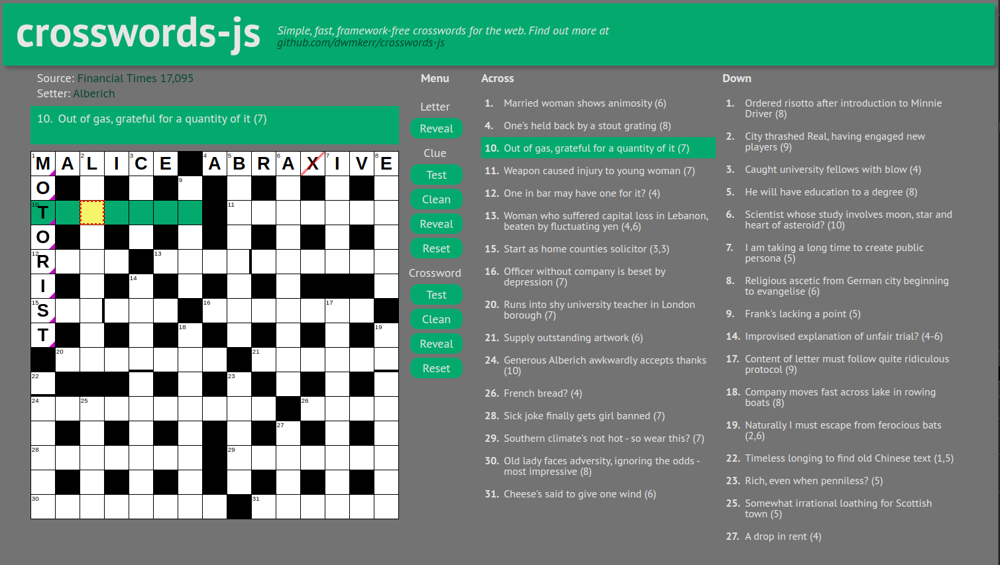

# CrosswordsJS

<!-- ALL-CONTRIBUTORS-BADGE:START - Do not remove or modify this section -->
[](#contributors-)
<!-- ALL-CONTRIBUTORS-BADGE:END -->
[](https://github.com/dwmkerr/crosswords-js/actions/workflows/release-please.yaml)
[](https://www.npmjs.com/package/@dwmkerr/template-nodejs-module)
[](https://codecov.io/gh/dwmkerr/crosswords-js)

Tiny, lightweight crossword for control for the web. Crossword.js is:

* Lightweight
* Fast
* Simple
* Framework Free

Inspired by the excellent free online crosswords on [The Guardian Crosswords](https://www.theguardian.com/crosswords).

Demo: [dwmkerr.github.io/crosswords-js/](https://dwmkerr.github.io/crosswords-js/)

<a href="https://dwmkerr.github.io/crosswords-js/"></a>

<!-- vim-markdown-toc GFM -->

* [Quickstart](#quickstart)
* [Developer Guide](#developer-guide)
* [Keyboard Functionality](#keyboard-functionality)
* [Crossword Definition Tips](#crossword-definition-tips)
* [Design Goals](#design-goals)
* [Build Pipelines](#build-pipelines)
    * [Pull Request Pipeline](#pull-request-pipeline)
    * [Release Pipeline](#release-pipeline)
* [Adding Contributors](#adding-contributors)
* [Managing Releases](#managing-releases)
* [Contributors](#contributors)
* [TODO](#todo)

<!-- vim-markdown-toc -->

## Quickstart

Install:

```sh
npm install crosswords-js
```

Include the JavaScript and CSS:

```html
<link href="node_modules/crosswords-js/dist/crosswords.css" rel="stylesheet">
<script src="node_modules/crosswords-js/dist/crosswords.js"></script>
```

To create a crossword, you start with a _Crossword Definition_, which is a simple JSON representation of a crossword:

```js
{
  "width": 15,
  "height": 15,
  "acrossClues": [
    {
      "x": 2, "y": 1,
      "clue": "1. Conspicuous influence exerted by active troops (8,5)"
    },
    {
      "x": 1, "y": 3,
      "clue": "10. A coy sort of miss pointlessly promoting lawlessness (9)"
    }
  ]
}
```

This definition needs to be compiled into a _Crossword Model_. The model is a two dimensional array of cells. This model is used as the input to create the DOM. Compiling the model validates it, making sure that there are no incongruities in the structure (such as overlapping clues, clues which don't fit in the bounds and so on):

```js
//  Load the crosswords.js API and the crossword definition.
const CrosswordsJS = require('crosswords-js');
const crosswordDefintion = require('./my-crossword.json');

//  Compile the crossword.
try {
  const crosswordModel = CrosswordsJS.compileCrossword(crosswordDefinition);
} catch (err) {
  console.log(`Error compiling crossword: ${err}`);
}
```

The model can be used to build the DOM for a crossword:

```js
//  Build the crossword HTML, as a child of the document body element.
var crosswordDom = new CrosswordsJS.CrosswordsDOM(document, crosswordModel, document.body);
```

## Developer Guide

Ensure you are using Node LTS. I recommend using [Node Version Manager](https://github.com/nvm-sh/nvm) for this:

```sh
nvm install --lts
nvm use --lts
```

Check out the code, then run:

```sh
make serve
```

The sample will run at the address [localhost:8080](http://localhost:3000/).

Run the tests with:

```sh
make test
```

## Keyboard Functionality

- Left/Right/Up/Down: Move (if possible) to the cell in the direction specified.
- Space: Move to the next cell in the focused clue, if one exists.
- Backspace: Move to the previous cell in the focused clue, if one exists.
- Tab: Move to the first cell of the next clue, 'wrapping' to the first clue.
- A-Z: Enter the character. Not locale aware!
- Enter: Switch between across and down.

## Crossword Definition Tips

**How do I create a clue which spans multiple parts of a crossword?**

This is a little fiddly. I have tried to ensure the syntax is as close to what a reader would see in a printed crossword to make this as clear as possible. Here is an example:

```
{
  "downClues": [{
    "x": 6, "y": 1
    "clue": "4,21. The king of 7, this general axed threat strategically (9)"
  }],
  "acrossClues": [{
    "x": 1, "y": 11,
    "clue": "21 See 4 (3,5)"
  }]
}
```

Note that the _answer structure_ (which would be `(9,3,5)` in a linear clue) has separated. However, the crossword will render the full answer structure for the first clue (and nothing for the others).

An example of a crossword with many non-linear clues is at: https://www.theguardian.com/crosswords/cryptic/28038 - I have used this crossword for testing (but not included the definition in the codebase as I don't have permissions to distribute it).

## Design Goals

This project is currently a work in progress. The overall design goals are:

1. This should be _agnostic_ to the type of crossword. It shouldn't depend on any proprietary formats or structures used by specific publications.
2. This should be _accessible_, and show how to make interactive content which is inclusive and supports modern accessibility patterns.
3. This project should be _simple to use_, without requiring a lot of third party dependencies or knowledge.

## Build Pipelines

There are two pipelines that run for the project:

### Pull Request Pipeline

Whenever a pull request is raised, the [Pull Request Workflow](./.github/workflows/pull-request.yaml) is run. This will:

- Install dependencies
- Lint
- Run Tests
- Upload Coverage

Each stage is run on all recent Node versions, except for the 'upload coverage' stage which only runs for the Node.js LTS version. When a pull request is merged to the `main` branch, if the changes trigger a new release, then [Release Please](https://github.com/google-github-actions/release-please-action) will open a Release Pull Request. When this request is merged, the [Release Pipeline](#release-pipeline) is run.

### Release Pipeline

When a [Release Please](https://github.com/google-github-actions/release-please-action) pull request is merged to main, the [Release Please Workflow](./.github/workflows/release-please) is run. This will:

- Install dependencies
- Lint
- Run Tests
- Upload Coverage
- Deploy to NPM if the `NPM_TOKEN` secret is set

Each stage is run on all recent Node versions, except for the 'upload coverage' stage which only runs for the Node.js LTS version.

⚠️ note that the NPM Publish step sets the package to public - don't forget to change this if you have a private module.

## Adding Contributors

To add contributors, use a comment like the below in any pull request:

```
@all-contributors please add @<username> for docs, code, tests
```

More detailed documentation is available at:

https://allcontributors.org/docs/en/bot/usage


## Managing Releases

When changes to `main` are made, the Release Please stage of the pipeline will work out whether a new release should be generated (by checking if there are user facing changes) and also what the new version number should be (by checking the log of conventional commits). Once this is done, if a release is required, a new pull request is opened that will create the release.

Force a specific release version with this command:

```bash
version="0.1.0"
git commit --allow-empty -m "chore: release ${version}" -m "Release-As: ${version}"
```

## Contributors

<!-- ALL-CONTRIBUTORS-LIST:START - Do not remove or modify this section -->
<!-- prettier-ignore-start -->
<!-- markdownlint-disable -->
<table>
  <tbody>
    <tr>
      <td align="center" valign="top" width="14.28%"><a href="http://www.dwmkerr.com"><br /><sub><b>Dave Kerr</b></sub></a><br /><a href="https://github.com/dwmkerr/crosswords-js/commits?author=dwmkerr" title="Documentation">📖</a> <a href="https://github.com/dwmkerr/crosswords-js/commits?author=dwmkerr" title="Code">💻</a> <a href="https://github.com/dwmkerr/crosswords-js/commits?author=dwmkerr" title="Tests">⚠️</a></td>
      <td align="center" valign="top" width="14.28%"><a href="https://github.com/pvspain"><br /><sub><b>Paul Spain</b></sub></a><br /><a href="https://github.com/dwmkerr/crosswords-js/commits?author=pvspain" title="Documentation">📖</a> <a href="https://github.com/dwmkerr/crosswords-js/commits?author=pvspain" title="Code">💻</a> <a href="https://github.com/dwmkerr/crosswords-js/commits?author=pvspain" title="Tests">⚠️</a></td>
    </tr>
  </tbody>
</table>

<!-- markdownlint-restore -->
<!-- prettier-ignore-end -->

<!-- ALL-CONTRIBUTORS-LIST:END -->
<!-- prettier-ignore-start -->
<!-- markdownlint-disable -->

<!-- markdownlint-restore -->
<!-- prettier-ignore-end -->

<!-- ALL-CONTRIBUTORS-LIST:END -->

## TODO

This is a scattergun list of things to work on, once a good chunk of these have been done the larger bits can be moved to GitHub Issues:

- [ ] bug: backspace moves backwards, I think that deleting the letter is a better action for this (with left/up/ key to move backwards)
- [ ] feat(docs): improve the demo site image (its an old one at the moment!)
- [ ] feat(samples): show how we can check answers or highlight incorrect entries (see issue #9)
- [ ] feat(samples): allow us to switch between 2-3 crosswords on the sample
- [ ] feat(samples): cursor initially on the first clue
- [ ] feat(dom): support a keyboard scheme or configurable keybindings so that keys for navigating / editing the crossword can be specified in config (allowing for schemes such as 'the guardian' or 'the age'
- [x] fix: the border on word separators slightly offsets the rendering of the grid
- [ ] feat(accessibility): get screenreader requirements
- [ ] refactor: Simplify the static site by removing Angular and Bootstrap, keeping everything as lean and clean as possible. Later, replace with a React sample? OR have multiple samples, one for each common framework?
- [ ] refactor: finish refactoring classes to simple functions (compileCrossword, createDOM etc)
- [ ] feat: support clues which span non-contiguous ranges (such as large clues with go both across and down).
- [ ] feat: simplify the crossword model by using `a` or `d` for `across` or `down` in the clue text (meaning we don't have to have two arrays of clues)
- [ ] feat: allow italics with underscores, or bold with stars (i.e. very basic markdown)...
- [ ] feat: clicking the first letter of a clue which is part of another clue should allow for a toggle between directions
- [ ] todo: document the clue structure
- [ ] refactor: re-theme site to a clean black and white serif style, more like a newspaper
- [x] build: enforce linting (current it is allowed to fail)
